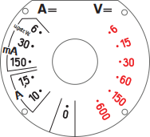
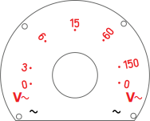
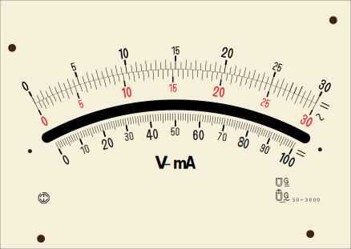
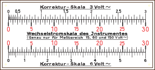
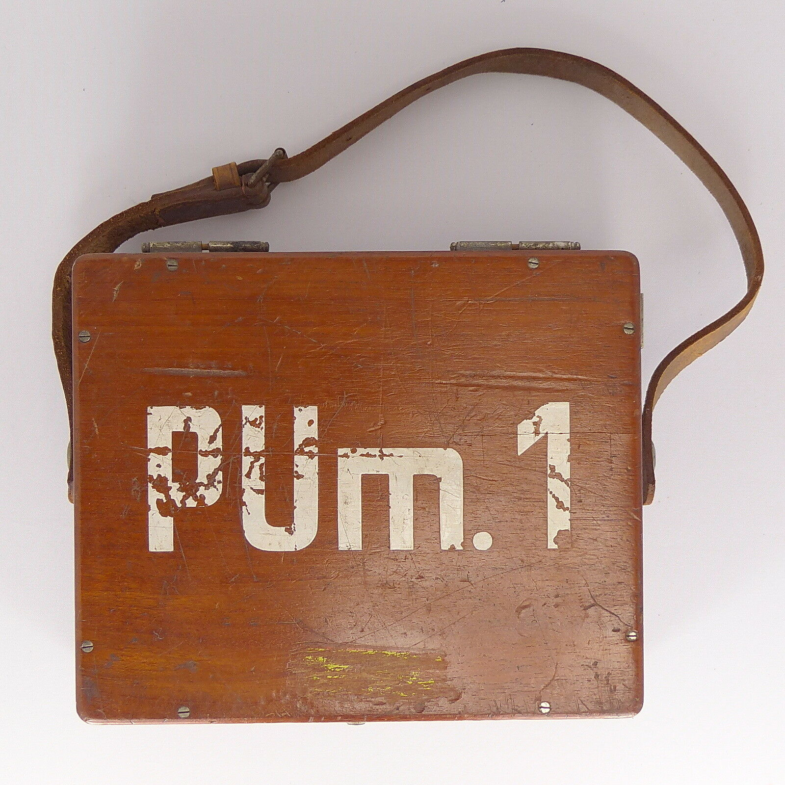
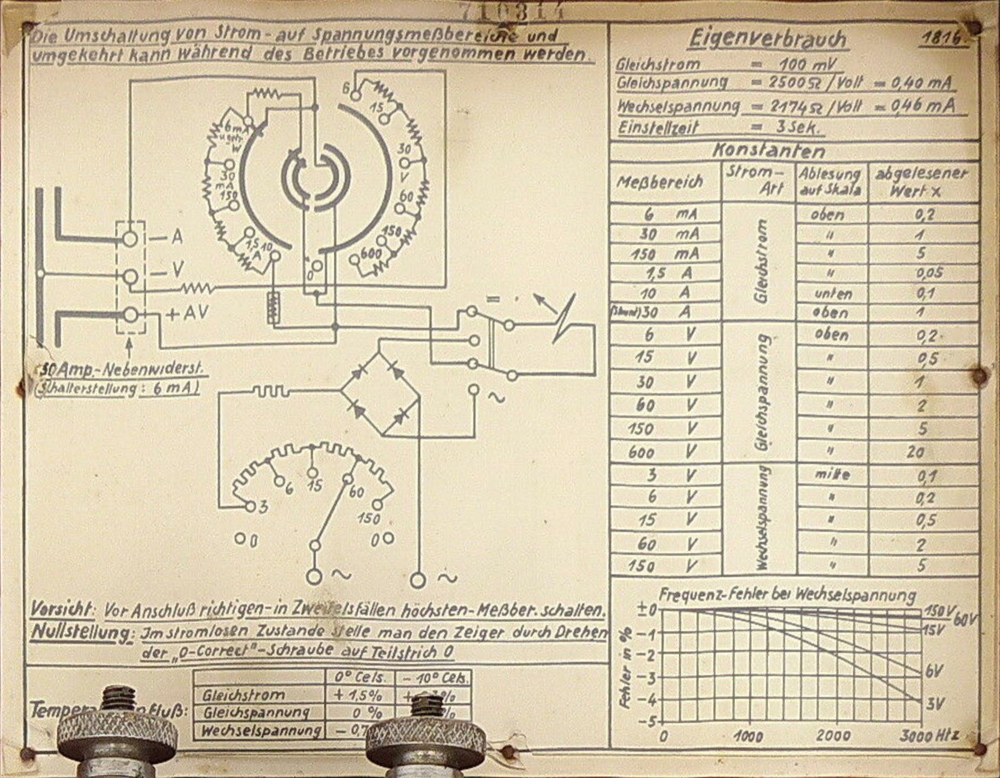

<h1 id="mowbray">Mowbray</h1>

<h2 id="mowbray_model350">Model 350 DC Ammeter</h2>

* [US Patent 1024218](Devices/Mowbray/Patent US1024218.pdf) (See also US858011, US860987.)
* [Shape Traces](Devices/Mowbray/Shape Traces.pdf): A 1:1 scale trace of the shape of the scale and of a metal sheet.

<h1 id="unknown">Unknown</h1>

<h2 id="pum1">German PUm.1 ammeter and voltmeter (1936-1937)</h2>

Model number is also written *P Um 1* and bears the designation *Fl.26767*. [More information collected here](Devices/Unknown/PUm.1/README.md).

| Images                                                       | Vector                                                       | Source File                                                  |
| ------------------------------------------------------------ | ------------------------------------------------------------ | ------------------------------------------------------------ |
|   |   | [Dials.ai](Devices/Unknown/PUm.1/Dials.ai)                   |
|  |         | [Gauge Scale.ai](Devices/Unknown/PUm.1/Gauge Scale.ai)       |
|  |  | [Korrektur-Skala.ai](Devices/Unknown/PUm.1/Korrektur-Skala.ai) |
|  |           | [PUm.1.ai](Devices/Unknown/PUm.1/PUm.1.ai)                   |
|  |  | [Schematic.ai](Devices/Unknown/PUm.1/Schematic.ai)           |
|  |  | Pieces to make the lid                                       |

